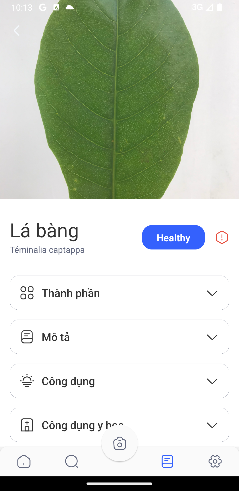

# PlantSnap App 

> PlantSnap API: https://plantsnap.com/api

This is a simple app that uses the PlantSnap API to identify plants from images taken by the user or uploaded from the gallery of the device and displays the results in a list. The user can then click on the list item to view more details about the plant including the common name, scientific name, and a brief description.

## My Figma Design

https://www.figma.com/design/50gvxj5Vl9TpBgboHayvKb/Untitled?node-id=0-1&t=MvIi5hKE3poiXst8-0

## Features 

- Login with Google, Facebook, or email and password
- Take a photo or upload an image from the gallery to identify a plant 
- View the results in a list 
- Click on a list item to view more details about the plant
- Save history of plant identifications 
- Send feedback to the developers 

## Screenshots 

 
